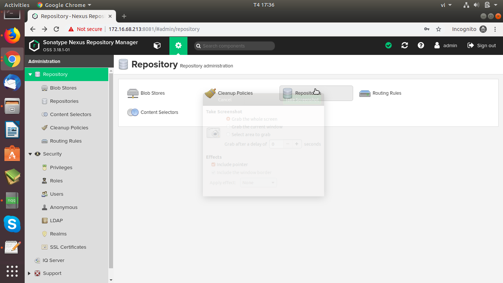
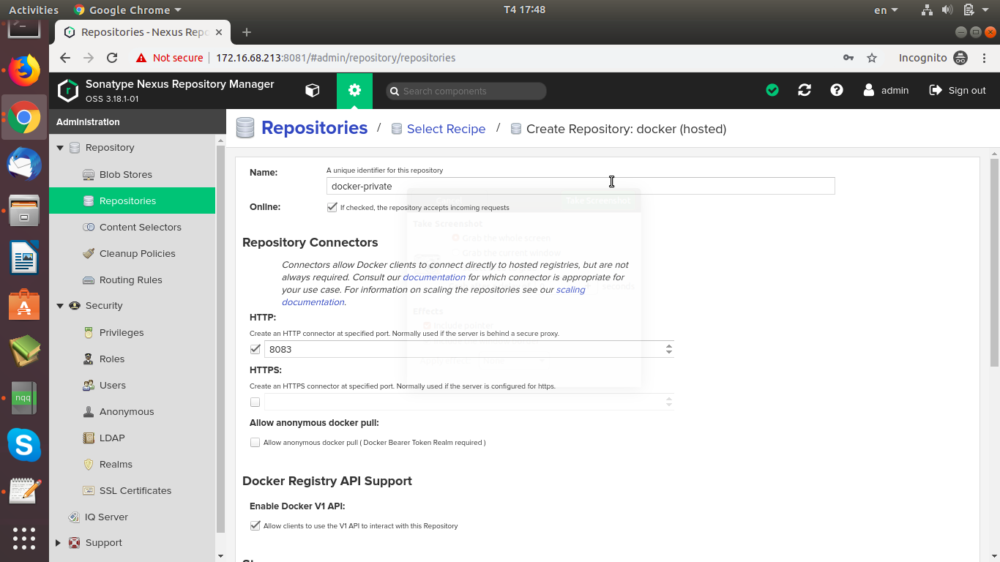
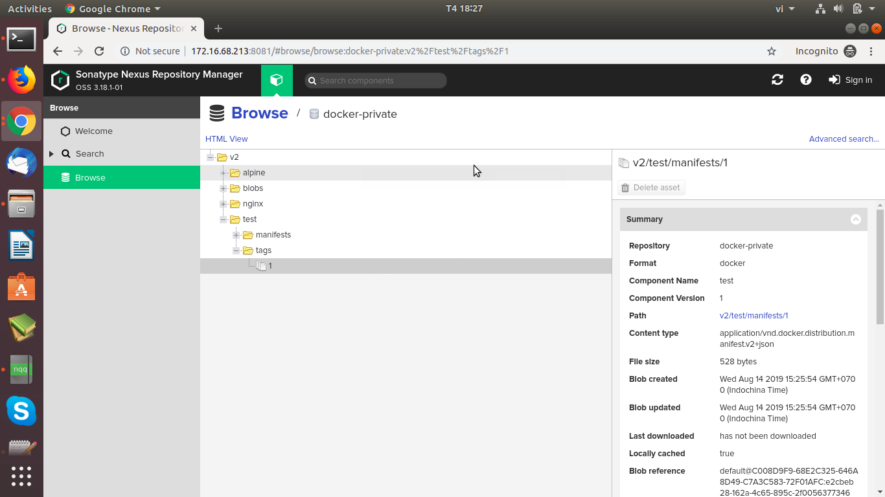

### Triển khai Docker Private Registry với Nexus và Nginx

### 1. Mô hình

- Master node:	172.16.68.209 - ubuntu 18.04 - 2c-4g-60gb
	
- Worker1:		172.16.68.210 - ubuntu 18.04 - 2c-4g-60gb
	
- Worker2: 		172.16.68.211 - ubuntu 18.04 - 2c-4g-60gb
	
- Registry: 	172.16.68.213 - ubuntu 18.04 - 4c-8g-120Gb.

### 2. Các bước thực hiện

#### Edit file /etc/hosts. Thực hiện trên tất cả các node

```
vim /etc/hosts
172.16.68.213	registry.thangtq.com
```

#### Thực hiện trên node master. Tạo thư mục chứa data của nexus-repo:

```
mkdir -p /data/nexus
chown -R 200: /data/nexus
```

#### Tạo ssl certificate cho nginx

- Thực hiện trên node registry

- B1: Tao thu muc chua cert file

```
mkdir -p /data/nginx/cert
cd /data/nginx/cert
```

- B2: Tao CA (Certificate Authority)

```
openssl req -newkey rsa:4096 -nodes -sha256 -keyout ca.key -x509 -days 365 -out ca.crt

Country Name (2 letter code) [AU]:VN
State or Province Name (full name) [Some-State]:Ha Noi
Locality Name (eg, city) []:HN
Organization Name (eg, company) [Internet Widgits Pty Ltd]:VCCorp
Organizational Unit Name (eg, section) []:Dept of Merriment
Common Name (e.g. server FQDN or YOUR name) []:registry.thangtq.com           
Email Address []:
```

- B3: Tạo Certificate Signing Request

```
openssl req -newkey rsa:4096 -nodes -sha256 -keyout registry.thangtq.com.key -out registry.thangtq.com.csr
```

- B4: Tạo certificate cho registry host

```
openssl x509 -req -days 365 -in registry.thangtq.com.csr -CA ca.crt -CAkey ca.key -CAcreateserial -out registry.thangtq.com.crt
```

#### Cài đặt, cấu hình nginx và registry nexus

- Thực hiện trên node registry

- B1: Tạo file /data/nginx/nginx.conf:

```
user  nginx;
  worker_processes  1;

  error_log  /var/log/nginx/error.log warn;
  pid        /var/run/nginx.pid;

   events {
      worker_connections  1024;
    }

    http {

    log_format  main  '$remote_addr - $remote_user [$time_local] "$request" '
                      '$status $body_bytes_sent "$http_referer" '
                      '"$http_user_agent" "$http_x_forwarded_for"';

    access_log  /var/log/nginx/access.log  main;

    proxy_send_timeout 120;
    proxy_read_timeout 300;
    proxy_buffering    off;
    keepalive_timeout  5 5;
    tcp_nodelay        on;

    server {
        listen         80;
        server_name    registry.thangtq.com;

	return         301 https://$server_name$request_uri;
    }

    server {
        listen   *:443 ssl;
        server_name  registry.thangtq.com;

        # allow large uploads of files - refer to nginx documentation
        client_max_body_size 1024m;

        # optimize downloading files larger than 1G - refer to nginx doc before adjusting
        #proxy_max_temp_file_size 2048m

        ssl on;
        ssl_certificate      /etc/nginx/nginx-signed.crt;
        ssl_certificate_key  /etc/nginx/nginx-signed.key;

        location / {
            proxy_pass http://nexus:8083/;
            proxy_set_header Host $host;
            proxy_set_header X-Real-IP $remote_addr;
            proxy_set_header X-Forwarded-For $proxy_add_x_forwarded_for;
	    proxy_set_header X-Forwarded-Proto "https";
        }
    }
}
```

- B2: Cài đặt Docker: 

```
https://www.digitalocean.com/community/tutorials/how-to-install-and-use-docker-on-ubuntu-18-04
```

- B3: Cài đặt docker-compose:

```
https://www.digitalocean.com/community/tutorials/how-to-install-docker-compose-on-ubuntu-18-04
```

- B4: Tạo file docker-compose.yaml:

```
version: "2"
services:
  nexus:
    image: sonatype/nexus3
    ports:
    - "8081:8081" # Port quản trị UI
    - "8083:8083" # Port registry
    volumes:
    - /data/nexus:/nexus-data
  nginx:
    image: nginx
    ports:
    - "80:80"
    - "443:443"
    volumes:
    - /data/nginx/nginx.conf:/etc/nginx/nginx.conf
    - /data/nginx/cert/registry.thangtq.com.crt:/etc/nginx/nginx-signed.crt
    - /data/nginx/cert/registry.thangtq.com.key:/etc/nginx/nginx-signed.key
    links:
    - nexus:nexus
```

- B5: Apply file docker-compose.yaml

```
docker-compose up -d
```

- B6: Truy cập vào Nexus Repository Manager với URL sau:

```
http://172.16.68.213:8081

```

- B7: Để làm việc với nexus, ta cần đăng nhập vào với user=admin và password mặc định lưu ở /data/nexus/admin.password.



- B8: Tạo repo private để lưu các docker-images. Vào phần “Server administration and configuration”, nhấn vào nút răng cưa bên cạnh ô "Search components" -> Create repository -> Chọn Recipe = docker(hosted):



#### Demo pull/push image lên registry với Docker

- B1: Tạo thư mục /etc/docker/certs.d/registry.thangtq.com trên node registry.

```
mkdir /etc/docker/certs.d/registry.thangtq.com
```

- B2: Copy file /data/nginx/cert/ca.crt vào thư mục /etc/docker/certs.d/registry.thangtq.com

- B3: Restart service docker

```
systemctl restart docker
```

- B4: Demo push image

```
docker login -u admin -p ahihi registry.thangtq.com
docker tag nginx:latest registry.thangtq.com/test:1
docker push registry.thangtq.com/test:1
```

- B5: Check push image:



- B6: Demo pull image:

```
docker pull registry.thangtq.com/test:1
```

#### Demo pull image với Kubernetes.

- B1: Tạo thư mục /etc/docker/certs.d/registry.thangtq.com trên tất cả các node trong cụm k8s.

```
mkdir /etc/docker/certs.d/registry.thangtq.com
```

- B2: Copy file ca.crt trên node 172.16.68.213 (registry) vào thư mục /etc/docker/certs.d/registry.thangtq.com trên các node trong cụm k8s.

- B3: Restart service docker trên các node trong cụm k8s

```
systemctl restart docker
```

- B4: Trên node master, thực hiện tạo secret

```
kubectl create secret docker-registry nexus-secret-registry --docker-server=registry.thangtq.com --docker-username=admin --docker-password=ahihi
```

- B5: Check secret vừa tạo

```
kubectl get secret
NAME                    TYPE                                  DATA   AGE
default-token-7nw49     kubernetes.io/service-account-token   3      8d
nexus-secret-registry   kubernetes.io/dockerconfigjson        1      130m
```

- B6: Demo deploy pod với image vừa tạo ở trên. Tạo file deployment-test-registry.yaml

```
apiVersion: apps/v1 # for versions before 1.9.0 use apps/v1beta2
kind: Deployment
metadata:
  name: test-registry
  labels:
    app: test-registry
spec:
  selector:
    matchLabels:
      app: test-registry
  replicas: 1
  template:
    metadata:
      labels:
        app: test-registry
    spec:
      containers:
      - name: nginx
        image: registry.thangtq.com/nginx:1.1
        ports:
        - containerPort: 80
      imagePullSecrets:
        - name: nexus-secret-registry
```

- B7: Check kết quả

```
kubectl get pod
test-registry-5d74bd9547-cbsks           1/1     Running   0          132m
```

### Link tham khảo

- https://blog.sonatype.com/using-nexus-3-as-your-repository-part-3-docker-images
- https://github.com/akailash/nginx_nexus
- https://www.sonatype.com/nexus-repository-oss-vs.-pro-features