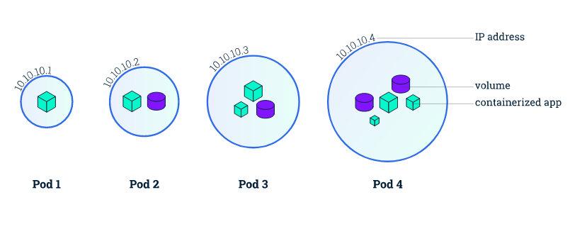
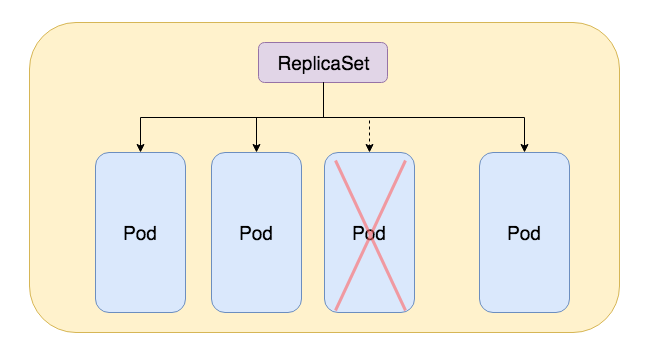
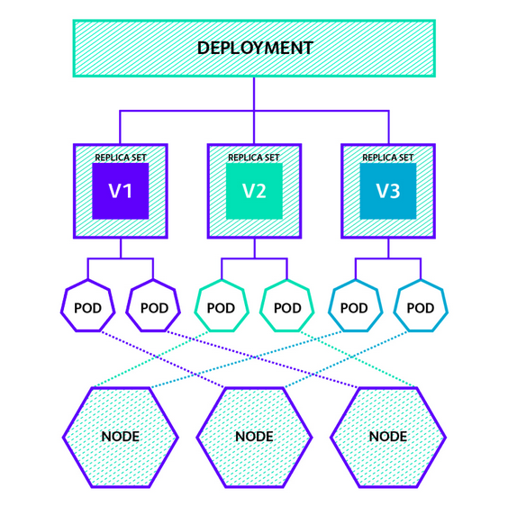
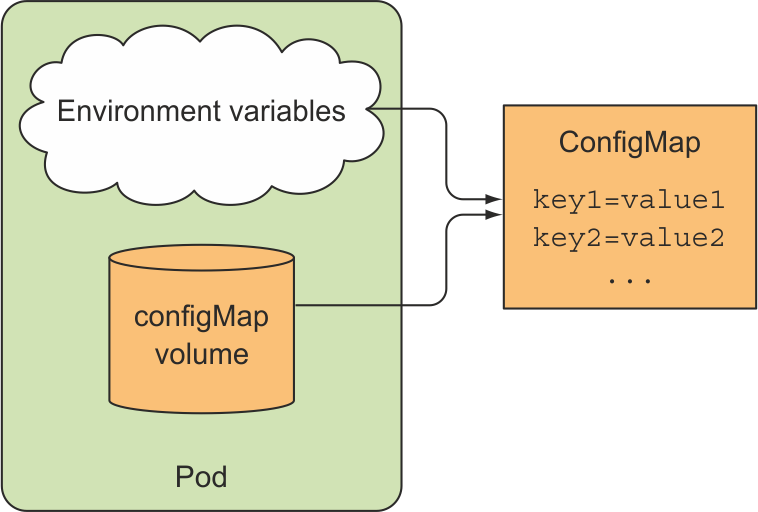
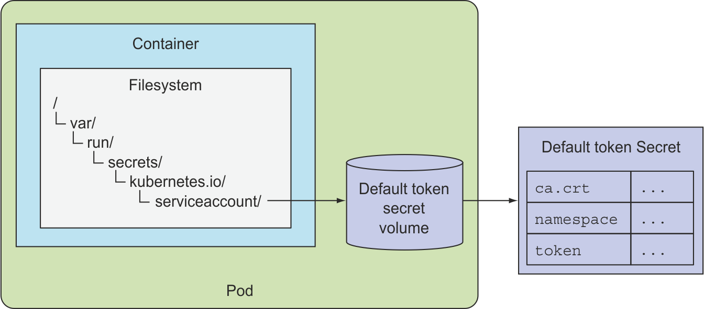

### Các loại resource trong k8s

### 1.Giới thiệu

- K8s gọi tất cả những thành phần có thể định nghĩa được là `Resource`. Vì thế pod, deployment, service, secret, configmap... đều được gọi chung là resource trong hệ thống k8s. Bạn có thể gõ `kubectl get` để xem k8s có những resource gì.

- Các loại resource chính trong k8s được sử dụng để triển khai các ứng dụng:

	* Resource nhóm Workloads: Resource liên quan đến thực thi container
	
		- Pod, ReplicaSet, Deployment, DaemonSet, StatefulSet, Job, CronJob
	
	* Resource nhóm Discover và Load Balancing: Resource cung cấp Endpoint - cho phép truy cập container từ bên ngoài cluster.
		
		- Service (svc): ClusterIP, NodePort, LoadBalancer, ExternalIP, ExtenalName
		
		- Ingress
	
	* Resource nhóm Config, Storage: Resource liên quan đến settings, persistent volumes, storageclass...
		
		- Secret
		
		- ConfigMap
		
		- PersistentVolumeClaim

    - Storageclass

- Ngoài ra, còn có các loại resource sau:
	
	* Cluster resource: Resource liên quan đến security và quota.
		
		- Namespace
		
		- ServiceAccount
		
		- Role
		
		- ClusterRole
		
		- RoleBinding
		
		- ClusterRoleBinding
		
		- NetworkPolicy
		
		- ResourceQuota
		
		- Node
	
	* Metadata resource: Resource cho việc quản lý resource
		
		- CustomResourceDefinition
		
		- LimitRange
		
		- HorizontalPodAutoscaler
	
### 2. Các loại resource nhóm Workloads trong k8s

- Trước khi đi vào chi tiết từng loại `resouce` trong k8s, ta cần nắm được khái niệm `Label` và `Selector`. Đây là 2 khái niệm được dùng trong hầu hết tất cả các loại `resource k8s`.

- `Label` là một cặp key-value gắn vào một `Kubernetes Resource`. Và mỗi `Kubernetes Resource` có thể có một hoặc nhiều `label`. `Label` phục vụ như một phương tiện để xác định cụ thể một Resource hoặc tập hợp các Resource.

- `Label Selector` cũng là các cặp key-value. Chúng dùng để chọn một label nhất định hoặc một tập hợp các label. Theo cơ chế này, một loại Resource có thể chọn (select) một hoặc nhiều các Resources thuộc loại khác.

### 2.1 Pod 

  

- Trong kubernetes, một hoặc một nhóm containers phục vụ cho cùng một mục đích được gọi là Pod. Pod là đơn vị nhỏ nhất trong k8s, và có những đặc điểm sau:

	* Pod là wraps (vỏ bọc) có thể chứa 1 hoặc nhiều containers. Thông thường, với các ứng dụng cơ bản thì mỗi pod sẽ gồm 1 container.
	
	* Mỗi pod có 1 IP duy nhất, điều này đúng kể cả pod có 2 hoặc nhiều containers trong đó.
	
  * Các containers trong 1 pod chạy trên "logical host": Các container sử dụng chung `network namespace` (sử dụng chung IP, port space, mỗi 1 containers trong pod sẽ phải sử dụng các port khác nhau.), `IPC namespace` và sử dụng chung volume được chia sẻ. Những đặc tính này làm cho các container có thể giao tiếp hiệu quả, đảm bảo dữ liệu cục bộ. 

#### Các loại container trong 1 pod

- `Application container`: Đây là core container của một ứng dụng, một Pod phải có loại container này.

- `Sidecar`: Pod có thể có container loại Sidecar làm một số việc để hỗ trợ cho application container. Một Pod có thể có nhiều Sidecar container.

- `Init`: Đôi khi cần phải thực hiện một số khởi tạo trước khi khởi chạy application container, ví dụ như khởi tạo database ban đầu. Một Pod có thể có nhiều Init container, chúng được chạy từng cái một theo thứ tự.

#### Triển khai 1 pod cơ bản trong k8s:

- Tạo 1 file busybox_pod.yaml với nội dung:

  ```
  apiVersion: v1
  kind: Pod
  metadata:
    name: busybox-pod
    labels:
      app: busybox
  spec:
    containers:
    - name: busybox-container
      image: busybox
      command: ['sh', '-c', 'echo Hello Kubernetes! && sleep 600']
  ```
  
- Apply pod này vào hệ thống với câu lệnh kubectl apply -f busybox_pod.yaml. Thực hiện check `pod` vừa được khởi tạo:

  ```
  kubectl get pod
  NAME          READY   STATUS    RESTARTS   AGE
  busybox-pod   1/1     Running   1          6m32s
   
  kubectl describe pod busybox-pod
  Name:               busybox-pod
  Namespace:          default
  Priority:           0
  PriorityClassName:  <none>
  Node:               node2/172.16.68.219
  Start Time:         Fri, 19 Apr 2019 11:01:55 +0700
  Labels:             app=busybox
  Annotations:        kubectl.kubernetes.io/last-applied-configuration:
                      {"apiVersion":"v1","kind":"Pod","metadata":{"annotations":{},"labels":{"app":"busybox"},"name":"busybox-pod","namespace":"default"},"spec"...
  Status:             Running
  IP:                 10.244.1.2
  Containers:
  busybox-container:
    Container ID:  docker://44416e67c1ac8a47c7608d12d5461211f833420cdf6374e89c51a0a8b53f72bc
    Image:         busybox
    Image ID:      docker-pullable://busybox@sha256:954e1f01e80ce09d0887ff6ea10b13a812cb01932a0781d6b0cc23f743a874fd
    Port:          <none>
    Host Port:     <none>
    Command:
      sh
      -c
      echo Hello Kubernetes! && sleep 300
    State:          Running
      Started:      Fri, 19 Apr 2019 11:07:25 +0700
    Last State:     Terminated
      Reason:       Completed
      Exit Code:    0
      Started:      Fri, 19 Apr 2019 11:02:14 +0700
      Finished:     Fri, 19 Apr 2019 11:07:14 +0700
    Ready:          True
    Restart Count:  1
    Environment:    <none>
    Mounts:
      /var/run/secrets/kubernetes.io/serviceaccount from default-token-6rcgp (ro)
  Conditions:
  Type              Status
  Initialized       True 
  Ready             True 
  ContainersReady   True 
  PodScheduled      True 
  Volumes:
  default-token-6rcgp:
    Type:        Secret (a volume populated by a Secret)
    SecretName:  default-token-6rcgp
    Optional:    false
  QoS Class:       BestEffort
  Node-Selectors:  <none>
  Tolerations:     node.kubernetes.io/not-ready:NoExecute for 300s
                 node.kubernetes.io/unreachable:NoExecute for 300s
  Events:
  Type    Reason     Age                    From               Message
  ----    ------     ----                   ----               -------
  Normal  Scheduled  9m18s                  default-scheduler  Successfully assigned default/busybox-pod to node2
  Normal  Pulling    3m58s (x2 over 9m15s)  kubelet, node2     Pulling image "busybox"
  Normal  Pulled     3m48s (x2 over 9m1s)   kubelet, node2     Successfully pulled image "busybox"
  Normal  Created    3m48s (x2 over 8m59s)  kubelet, node2     Created container busybox-container
  Normal  Started    3m47s (x2 over 8m59s)  kubelet, node2     Started container busybox-container
  ```
- Để check log của `Pod` ta sử dụng lệnh `kubectl logs`, cụ thể:

- Xuất log của container bên trong Pod

  ```
  kubectl logs nginx-pod
  ```
  
- Có thể chỉ định cụ thể log của container nào trong pod có nhiều container

  ```
  kubectl logs nginx-pod -c nginx-container
  ```
 
- Lệnh này thì giống kiểu tail -f (follow log)

  ```
  kubectl logs -f nginx-pod
  ```

- Xuất log trong 1 giờ trước、lấy 10 record, hiển thị timestamps
  
  ```
  kubectl logs --since=1h --tail=10 --timestamps=true nginx-pod
  ```
  
- Xóa `pod`:
  
  ```
  kubectl delete pod busybox-pod
  pod "busybox-pod" deleted
  ```

### 2.2 Replicaset

  

- Replicaset là đơn vị sinh ra để đảm bảo rằng số lượng pod của một ứng dụng muốn duy trì trong hệ thống phải được ổn định. Ví dụ khi deploy ứng dụng chạy nginx và nói với hệ thống rằng ở bất cứ thời điểm nào đều phải duy trì 3 pod nginx này. Khi một pod nginx crash, hệ thống k8s sẽ tự động start một pod khác lên để đảm bảo số lượng pod được định nghĩa trong ReplicaSet.

- Ví dụ 1 file định nghĩa replicaset:

  ```
  apiVersion: apps/v1
  kind: ReplicaSet
  metadata:
    name: internal-loadbalancer
    labels:
      app: lb
      tier: internal-loadbalancer
  spec:
    # So luong pod ban muon
    replicas: 3
    selector:
      matchLabels:
        app : nginx
    template:
      metadata:
        labels:
          app: nginx
      spec:
        containers:
        - name: nginx-pod
          image: nginx
          resources:
            requests:
              cpu: 100m
              memory: 100Mi
          ports:
          - containerPort: 80
  ```
  
### 2.3. Deployment

    
  
- Deployment là 1 đối tượng wrap pod hoặc replicaset, nó cho phép quản lý vòng đời của các Pod và ReplicaSet. Khi khởi tạo một deployment, hệ thống tự động khởi tạo kèm theo nó một replicaset và các pods được khai báo trong deployment. Deployment được khuyến khích sử dụng thay vì triển khai một pod hay replicaset riêng biệt.
    
- Đặc biệt, Deployment trong Kubernetes cung cấp tính năng rolling update và rollout update. Với rolling update, Deployment cho phép cập nhật một ứng dụng đang chạy tỉ lệ downtime thấp nhất (hoặc không có downtime). Còn với rollout update, ta có thể rollback một revision của deployment.
	
- Ví dụ về triển khai 1 deployment chạy ứng dụng nginx, và cách thực hiện Rolling Updates và Rolling Back (rollback) trong `deployment`:

   ```
   apiVersion: apps/v1
   kind: Deployment
   metadata: 
     labels: 
       app: nginx
     name: nginx-deployment
  spec: 
    replicas: 3
    selector: 
      matchLabels: 
        app: nginx
    template: 
      metadata: 
        labels: 
          app: nginx
      spec: 
        containers: 
          - 
            image: "nginx:1.7.9"
            name: nginx
   ```

- Check `Deployment` trên:

  ```
  kubectl get deployments -o wide
  NAME               READY   UP-TO-DATE   AVAILABLE   AGE   CONTAINERS   IMAGES        SELECTOR
  nginx-deployment   3/3     3            3           25m   nginx        nginx:1.7.9   app=nginx
  ```
  
- Kiểm tra chi tiết các thông tin của `Deployment` với lệnh `kubectl describe deployment [deployment name]`. Để hiểu rõ về việc rolling update và rollback của 1 `deployment`, cần chú ý các thông tin sau: **created time stamp, labels, revision number, labels, selector, image version, events.**

  ```
  kubectl describe deployment nginx-deployment
  
  Name:                   nginx-deployment
  Namespace:              default
  CreationTimestamp:      Fri, 19 Apr 2019 14:46:09 +0700
  Labels:                 app=nginx
  Annotations:            deployment.kubernetes.io/revision: 1
  Selector:               app=nginx
  Replicas:               3 desired | 3 updated | 3 total | 3 available | 0 unavailable
  StrategyType:           RollingUpdate
  MinReadySeconds:        0
  RollingUpdateStrategy:  25% max unavailable, 25% max surge
  Pod Template:
    Labels:  app=nginx
    Containers:
    nginx:
    Image:        nginx:1.7.9
    Port:         <none>
    Host Port:    <none>
    Environment:  <none>
    Mounts:       <none>
  Volumes:        <none>
  Conditions:
  Type           Status  Reason
  ----           ------  ------
  Available      True    MinimumReplicasAvailable
  Progressing    True    NewReplicaSetAvailable
  OldReplicaSets:  <none>
  NewReplicaSet:   nginx-deployment-759fccf44f (3/3 replicas created)
  
  Events:
  Type    Reason             Age   From                   Message
  ----    ------             ----  ----                   -------
  Normal  ScalingReplicaSet  16m   deployment-controller  Scaled up replica set nginx-deployment-759fccf44f to 3
  ```
  
- Tiếp theo, thực hiện rolling updates `Deployment`: Ở trên, ta thấy image nginx trên version 1.7.9, giờ sẽ thực hiện update lên version 1.13.10.

- Thực hiện lệnh sau để running image nginx version 1.13.10:

  ```
  kubectl set image deployment/[deployment_name] nginx=nginx:[new_version]
  
  kubectl set image deployment/nginx-deployment nginx=nginx:1.13.10
  ```

- Check trạng thái rolling update:

  ```
  kubectl rollout status deployment/nginx-deployment
  Waiting for deployment "nginx-deployment" rollout to finish: 2 out of 3 new replicas have been updated...
  Waiting for deployment "nginx-deployment" rollout to finish: 2 out of 3 new replicas have been updated...
  Waiting for deployment "nginx-deployment" rollout to finish: 2 out of 3 new replicas have been updated...
  Waiting for deployment "nginx-deployment" rollout to finish: 1 old replicas are pending termination...
  Waiting for deployment "nginx-deployment" rollout to finish: 1 old replicas are pending termination...
  deployment "nginx-deployment" successfully rolled out
  ```
  
- Check trạng thái `deployment` sau khi thực hiện rolling update

  ```
  kubectl describe deployment nginx-deployment
  Name:                   nginx-deployment
  Namespace:              default
  CreationTimestamp:      Fri, 19 Apr 2019 14:46:09 +0700
  Labels:                 app=nginx
  Annotations:            deployment.kubernetes.io/revision: 2
  Selector:               app=nginx
  Replicas:               3 desired | 3 updated | 3 total | 3 available | 0 unavailable
  StrategyType:           RollingUpdate
  MinReadySeconds:        0
  RollingUpdateStrategy:  25% max unavailable, 25% max surge
  Pod Template:
  Labels:  app=nginx
  Containers:
   nginx:
    Image:        nginx:1.13.10
    Port:         <none>
    Host Port:    <none>
    Environment:  <none>
    Mounts:       <none>
  Volumes:        <none>
  Conditions:
  Type           Status  Reason
  ----           ------  ------
  Available      True    MinimumReplicasAvailable
  Progressing    True    NewReplicaSetAvailable
  OldReplicaSets:  <none>
  NewReplicaSet:   nginx-deployment-5cd547df8d (3/3 replicas created)
  Events:
  Type    Reason             Age   From                   Message
  ----    ------             ----  ----                   -------
  Normal  ScalingReplicaSet  49m   deployment-controller  Scaled up replica set nginx-deployment-759fccf44f to 3
  Normal  ScalingReplicaSet  20m   deployment-controller  Scaled up replica set nginx-deployment-5cd547df8d to 1
  Normal  ScalingReplicaSet  19m   deployment-controller  Scaled down replica set nginx-deployment-759fccf44f to 2
  Normal  ScalingReplicaSet  19m   deployment-controller  Scaled up replica set nginx-deployment-5cd547df8d to 2
  Normal  ScalingReplicaSet  19m   deployment-controller  Scaled down replica set nginx-deployment-759fccf44f to 1
  Normal  ScalingReplicaSet  19m   deployment-controller  Scaled up replica set nginx-deployment-5cd547df8d to 3
  Normal  ScalingReplicaSet  19m   deployment-controller  Scaled down replica set nginx-deployment-759fccf44f to 0
  ```
- -> Sau khi thực hiện rolling update, thông số revision: 2 và image lúc này là: `nginx:1.13.10`  

- Tiếp theo, ta sẽ thực hiện rollback lại ứng dụng nginx sử dụng image `nginx:1.7.9`: 

- Check history các bản `deployment`:

  ```
  kubectl rollout history deployment/nginx-deployment --revision=[revision_number]
  
  kubectl rollout history deployment/nginx-deployment --revision=1
 
  deployment.extensions/nginx-deployment with revision #1
  Pod Template:
  Labels:	app=nginx
	pod-template-hash=759fccf44f
  Containers:
   nginx:
    Image:	nginx:1.7.9
    Port:	<none>
    Host Port:	<none>
    Environment:	<none>
    Mounts:	<none>
  Volumes:	<none>
  ```

- Thực hiện rollback lại bản `revision=1` bằng lệnh sau:

  ```
  kubectl rollout undo deployment/nginx-deployment --to-revision=1
  ```
 
- Sau khi thực hiện rollback ta thấy, image lúc này: `nginx:1.7.9`

  ```
  kubectl get deployments -o wide
  NAME               READY   UP-TO-DATE   AVAILABLE   AGE   CONTAINERS   IMAGES        SELECTOR
  nginx-deployment   3/3     3            3           70m   nginx        nginx:1.7.9   app=nginx
  ```

- `Deployment` thường được sử dụng để triển khai ứng dụng stateless.
- `Stateless application` là ứng dụng không cần permanent storage. Ví dụ như Apache, nginx, Tomcat...

- Hình vẽ sau sẽ cho ta thấy rõ hơn quá trình tạo pods(containers), mối liên hệ giữa Deployment, ReplicaSet, Pod:


- Khi có yêu cầu tạo 1 Deployment từ client. Ở đây là kubectl sẽ giao tiếp với `API server` (trên master node) thông báo cần khởi tạo 1 Deployment.
-  `API server` sẽ thông báo với `Deployment controller`, `ReplicaSet controller` ở Controller yêu cầu cần tạo 1 Deployment/ReplicaSet với bao nhiêu Pods.
- Sau khi có yêu cầu tạo Pods (với bao nhiêu RAM, CPU...), Scheduler sẽ thực hiện lựa chọn ra node worker phù hợp để deploy và thông báo tới API Server.

- Sau khi lựa chọn được node worker phù hợp từ `Scheduler`, `API Server` sẽ giao tiếp với node đó qua `kubelet` để thực hiện deploy các Pods lên.

- Trên node worker có yêu cầu deploy Pods, `kubelet` sẽ giao tiếp với Docker (hoặc 1 container runtime) để khởi tạo các containers.

### 2.5. Statefulset

- StatefulSet được sử dụng để triển khai các ứng dụng stateful. Ví dụ: Mysql clusters, Kafka, Aerospike, MongoDb...

- Ví dụ về 1 ứng dụng stateful. Giả sử ta triển khai 1 cụm `etcd` chạy trên k8s, để hệ thống k8s hoạt động chính xác, các `node master` cần phải biết chính xác thông tin từng instace `etcd`. Tương tự, các instance `etcd` sẽ thiết lập các kết nối với nhau để bầu chọn `leader`. Để đảm bảo điều này, ta cần đảm bảo các pods chạy etcd có thể liên lạc với nhau thông qua 1 danh tính duy nhất không thay đổi (hostname, IP, ...).
	
### 2.6. DaemonSet

- Một `DaemonSet` trong Kubernetes đảm bảo một Pod chạy trên tất cả hoặc tập hợp các Kubernetes Node đã sẵn sàng. Một trong những đặc điểm của việc sử dụng `DaemonSet` là khi thêm 1 Node mới vào Kubernetes Cluster, thì `DaemonSet` sẽ tự động sinh ra Pod trên node đó. Ngay khi Node được xóa khỏi Kubernetes Cluster, thì Pod liên quan cũng được `garbage collector` thu gom. Ví dụ: `kube-proxy` là 1 `DaemonSet`. 

- Các trường hợp sử dụng `DaemonSet`:
	
	* Chạy Cluster storage daemon như `glusterd` hoặc `ceph` trên mỗi node.
	
	* Chạy log collector daemon trên mỗi node như `fluentd` hoặc `logstash`.
	
	* Chạy monitoring daemon trên mỗi node như `Prometheus Node Exporter`, `Datadog agent` hoặc `gmond`.
	
- Ví dụ về 1 file `daemonset.yaml` dùng để chạy `fluentd-elasticsearch`:

  ```
  apiVersion: apps/v1
  kind: DaemonSet
  metadata:
    name: fluentd-elasticsearch
    namespace: kube-system
    labels:
      k8s-app: fluentd-logging
  spec:
    selector:
      matchLabels:
        name: fluentd-elasticsearch
    template:
      metadata:
        labels:
          name: fluentd-elasticsearch
      spec:
        tolerations:
        - key: node-role.kubernetes.io/master
          effect: NoSchedule
        containers:
        - name: fluentd-elasticsearch
          image: gcr.io/fluentd-elasticsearch/fluentd:v2.5.1
          resources:
            limits:
              memory: 200Mi
            requests:
              cpu: 100m
              memory: 200Mi
          volumeMounts:
          - name: varlog
            mountPath: /var/log
          - name: varlibdockercontainers
            mountPath: /var/lib/docker/containers
            readOnly: true
        terminationGracePeriodSeconds: 30
        volumes:
        - name: varlog
          hostPath:
            path: /var/log
        - name: varlibdockercontainers
          hostPath:
            path: /var/lib/docker/containers
  ```

### 2.7. Job

- `Job` tạo 1 hoặc nhiều `Pod` để thực hiện 1 tác vụ nào đó và chỉ xử lý 1 lần. `Job` có thể tạo các Pod chạy tuần tự hoặc song song. `Job` được gọi là thành công khi các pods ở trạng thái "successfully terminate".

- Khi Job tạo Pod, vì lý do nào đó như Node lỗi... Pod bị xóa khi chưa hoàn thành thì Job sẽ thực hiện tạo Pod khác để tiếp tục thi hành tác vụ đó.

- `Job` thường được sử dụng khi muốn thi hành một vài chức năng hoàn thành xong thì dừng lại (ví dụ backup, kiểm tra ...)

#### Triển khai 1 job cơ bản:

- Tạo file job.yaml

```
apiVersion: batch/v1
kind: Job
metadata:
  name: myjob
spec:
  # Số lần chạy POD thành công
  completions: 10
  # Số lần tạo chạy lại POD bị lỗi, trước khi đánh dấu job thất bại
  backoffLimit: 3
  # Số POD chạy song song
  parallelism: 2
  # Số giây tối đa của JOB, quá thời hạn trên hệ thống ngắt JOB
  activeDeadlineSeconds: 120

  template:
    spec:
      containers:
      - name: busybox
        image: busybox
        command:
          - /bin/sh
          - -c
          - date; echo "Job executed"
      restartPolicy: Never
```

- Apply file job.yaml

```
kubectl apply -f job.yaml
```

- Kiểm tra thông tin job vừa tạo:

```
kubectl describe job/myjob
```

### 2.8. Cronjob

- Cronjob - thực hiện chạy các Job theo 1 lịch định sẵn. Việc lên lịch cho CronJob trong k8s khai báo giống Cron của Linux.

#### Cronjob cơ bản: cronjob.yaml

```
apiVersion: batch/v1beta1
kind: CronJob
metadata:
  name: mycronjob
spec:
  # 5' chạy một Job
  schedule: "*/5 * * * *"
  # Số Job lưu lại
  successfulJobsHistoryLimit: 3
  jobTemplate:
    spec:
      template:
        spec:
          containers:
          - name: busybox
            image: busybox
            args:
            - /bin/sh
            - -c
            - date; echo "Job in CronJob"
          restartPolicy: Never
``` 

### 3. Resource nhóm Config

### 3.1. Configmap

- "Tách cấu hình khỏi code" là một trong những tiêu chuẩn để build 1 ứng dụng. Khi deploy ứng dụng lên k8s, ta cũng sẽ có nhu cầu cấu hình các biến môi trường hoặc khởi tạo tách file config cho các Pod. `ConfigMap` sẽ hỗ trợ làm công việc này.



- ConfigMap được sử dụng để lưu trữ các data "không cần đảm bảo bí mật" dưới dạng key-value. Pods có thể sử dụng ConfigMaps như các biến môi trường, command-line arguments, hoặc file cấu hình ở trong volume.


### 3.2. Secrets

- Tương tự như ConfigMap nhưng Secrets được sử dụng để lưu trữ các data "cần đảm bảo bí mật" như password, ssh-keys...




- Note: Các resouce nhóm Discover và Load Balancing, Storage sẽ nói ở phần network, storage.

### 4. Link tham khảo
	
- https://blogd.net/kubernetes/kien-truc-kubernetes/

- https://kubernetes.io/docs/concepts/

- https://www.techcrumble.net/2019/01/kubernetes-deployment-rolling-updates-and-rolling-back/


