### 1. Giới thiệu:

- Một trong những phần phức tạp và quan trọng nhất khi tìm hiểu về k8s là phần Network. Để hiểu rõ về network trong k8s, ta cần tập trung vào 4 phần:

	* Network on Pod
	
	* Pod-to-Pod communications
	
	* Pod-to-Service communications
	
	* External-to-Service communications

### 2. Network on Pod

- Trong k8s, mỗi Pod có 1 IP.

- IP của 1 pod được chia sẻ bởi tất cả các container trong Pod này, và mặc định nó có thể kết nối từ tất cả các Pod khác trong 1 cụm k8s. 

- Bạn có bao giờ để ý thấy 1 số container `pause` đang chạy trên tất cả các node trong k8s? 
  
  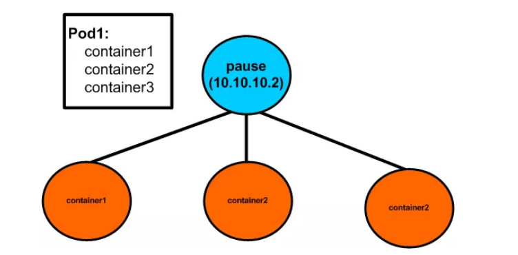

- Chúng được gọi là các `sandbox containers`, có nhiệm vụ lưu giữ `network namespace` (netns) được chia sẻ bởi tất cả các container trong 1 pod. Với cơ chế này, trong 1 Pod khi 1 container chết hoặc 1 container mới được tạo thì IP Pod sẽ không bị thay đổi.

### 3. Pod-to-Pod communications

- Trong k8s, để kết nối giữa các pods, ta cần sử dụng 1 network plugin như Flannel, Calico, Cannal, Weave... Ở trong bài này, tôi sẽ nói về sử dụng `Flannel` để kết nối giữa các pods trong k8s.

### 3.1. Flannel

### Khái niệm: 

- Flannel là một giải pháp overlay network được sử dụng để cấu hình network trong k8s. Về cơ bản, cơ chế overlay networks sẽ sử dụng backend (VXLAN, GRE...) để đóng gói `packet-in-packet` đi qua underlay networks (hạ tầng mạng vật lí cơ bản). Ở đây, Flannel sử dụng backend VXLAN.

- Flannel chạy 1 tiến trình agent có tên là flanneld trên tất cả các node trong cụm k8s. Tiến trình này chịu trách nhiệm phân bổ `subnet lease` trên mỗi node.

- Flannel sẽ lưu tất cả các thông tin vào etcd: lưu trữ cấu hình mạng, subnet được phân bổ như nào và bất kì dữ liệu phụ trợ nào khác ( như IP public của host).

### Kết nối giữa các Pod trên 1 node

 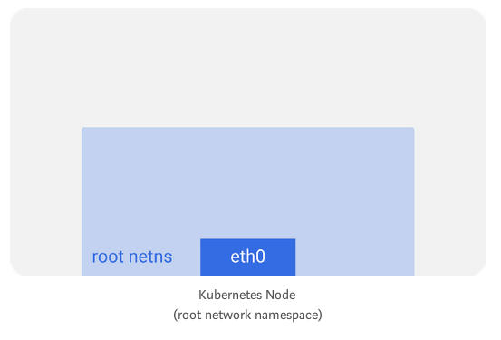
 
- Trên mỗi node trong cụm k8s (chạy hệ điều hành linux) sẽ có 1 `root network namespace` ( root netns). Interface chính `eth0` nằm trong `root network namespace` này.

- Tương tự, mỗi pod sẽ có netns riêng, với 1 virtual ethernet (veth) kết nối nó tới `root netns`. Bạn có thể hiểu `veth` là 1 đường ống có 2 đầu dùng để kết nối, 1 đầu được gắn với root netns và đầu còn lại gắn với pod netns.

  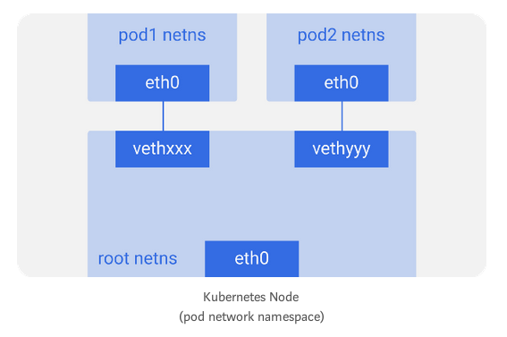  

- Bạn có thể liệt kê tất cả các network interface trên node với lệnh `ifconfig` hoặc `ip a`.

- Với plugin network Flannel, sẽ sử dụng 1 bridge `cni0` để các pod trên 1 node nói chuyện với nhau.

  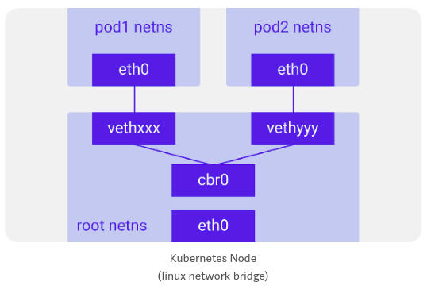
  
- Bạn có thể list các bridge bằng lệnh `brctl show`.

- Traffic flows:
  
  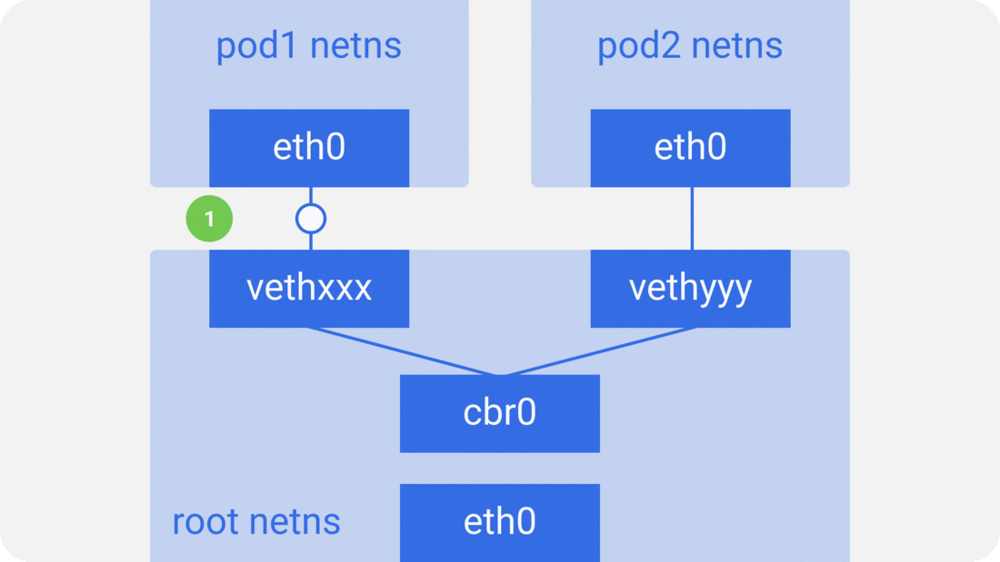

	* 1.Gói tin từ pod1 đi vào root netns tại `vethxx`.
  
	* 2.Gói tin được chuyển tới bridge `cbr0`, để phát hiện ra đích đến của gói tin bằng cách sử dụng `ARP request`, nói rằng pod nào có IP này? 
  
	* 3.`vethyyy` nói rằng nó có IP đó, vì vậy bridge `cbr0` sẽ biết nơi chuyển tiếp gói tin.
  
	* 4.Gói tin được gửi đến `vethyyy`, và gửi đến pod2.
  
### Kết nối giữa các pod trên các node khác nhau

- Mỗi node trong cụm k8s sẽ được gán 1 `CIDR block` (1 dải địa chỉ IP) để cấp cho các pods, vì vậy mỗi pod có 1 IP duy nhất và không bị conflict với các pods trên tất cả các node khác trong cụm k8s.

### Traffic flows

  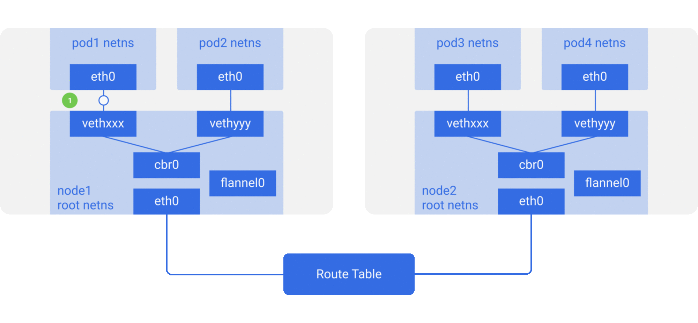

- Luồng gói tin gửi từ pod1 đến pod4 (trên node khác):
 
	* 1.Gói tin từ `pod1` netns tại `eth0` trên pod 1 được gửi vào root netns tại `vethxxx`.
  
  	* 2.Gói tin chuyển tới `cbr0`, và gửi yêu cầu ARP để tìm destination của gói tin.
  
  	* 3a.Vì không pod nào trên node này có địa chỉ IP cho `pod4`, nên bridge `cbr0` gửi nó tới `flannel0`. Bảng định tuyến của node được cấu hình với `flannel0` làm mục tiêu cho range IP pod. Các thông tin cấu hình này được lưu ở `etcd`.
  
  	* 3b.Tiến trình `flanneld` daemon đọc thông tin trong `etcd`, nó sẽ biết về tất cả các IP của pod và các dải IP của pod đang nằm trên node nào. Vì vậy, `flannel` sẽ ánh xạ các IP pod với IP của các node. `flannel0` lấy gói tin này và đóng gói vào trong gói UDP với các header bổ sung thay đổi IP nguồn và IP đích đến các node tương ứng và gửi nó đến 1 port đặc biệt `vxlan` (thường là 8472).
  
    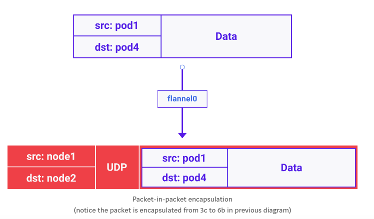
	
	* 3c.Gói tin này được đóng gói và gửi qua eth0.
	
	* 4.Gói tin rời khỏi node với sourceIP là IP node1 và destIP là IP node2.
	
	* 5.Bảng định tuyến của mạng vật lí đã biết cách định tuyến giữa các node, do đó nó gửi gói tin đến node2.
	
	* 6a.Gói tin này đến `eth0` của node2. Do port là port đặc biệt `vxlan`, kernel sẽ gửi gói tin đến `flannel0`.
	
	* 6b.`flannel0` sẽ thực hiện de-capsulates và gửi nó vào trong root netns.
	
	* 6c.`Với IP forwarding được enabled`, kernel sẽ chuyển tiếp gói tin tới `cbr0`.
	
	* 7.Bridge `cbr0` sẽ lấy gói tin và thực hiện 1 request ARP và phát hiện ra rằng IP này thuộc về `vethyyy`.
	
	* 8.Gói tin sẽ đi qua `vethyyy` và được gửi tới pod4.

- Một số lưu ý khi sử dụng Flannel:
	
	* Flannel sử dụng công nghệ `vxlan`: không có mã hóa giữa các node.
	
	* Flannel không hỗ trợ NetworkPolicy trong k8s.

### NetworkPolicy trong k8s

- Mặc định trong 1 cụm k8s, tất cả các Pod sẽ nói chuyện được với nhau. Để tăng tính bảo mật cho các ứng dụng, trong k8s sử dụng resource `NetworkPolicy`.

- `NetworkPolicy` cho phép bảo mật các ứng dụng bằng cách cung cấp các Policy để kiểm soát các kết nối vào/ra giữa các pods trong k8s. Tuy nhiên, bản thân k8s không có khả năng thực thi các network policy này. Để thực thi các network policy, ta cần phải sử dụng 1 network plugin có khả năng thực thi các network policy này (Calico, Cannal...). Bản chất khi cấu hình `NetworkPolicy` là sẽ tạo ra các rule iptables.

- Trước khi cấu hình NetworkPolicy:

  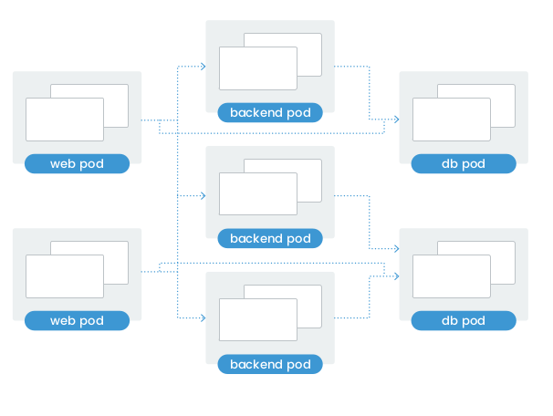

- Sau khi cấu hình NetworkPolicy:
  
  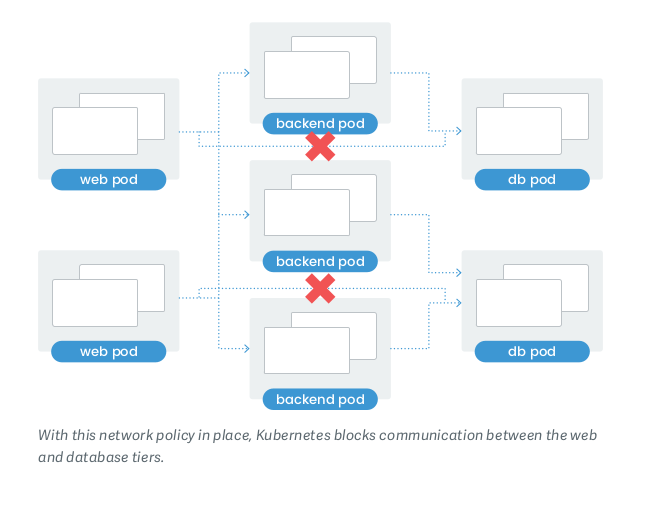

**Ví dụ về NetworkPolicy:

- Các pod:
  
  ```
  kubectl get pod -o wide
  NAME                        READY   STATUS    RESTARTS   AGE     IP               NODE      NOMINATED NODE   READINESS GATES
  backend-6db5cdbb4b-b9tdm    1/1     Running   0          2m36s   192.168.189.77   worker2   <none>           <none>
  db-5b54c87fdb-v6rl2         1/1     Running   0          3m36s   192.168.189.75   worker2   <none>           <none>
  frontend-5575ff85dd-76frq   1/1     Running   0          2m42s   192.168.189.76   worker2   <none>           <none>
  frontend-5575ff85dd-gz467   1/1     Running   0          2m42s   192.168.182.8    worker3   <none>           <none>
  frontend-5575ff85dd-hd9rf   1/1     Running   0          2m42s   192.168.182.7    worker3   <none>           <none>
  ```
  
- Trước khi cấu hình Networkpolicy, các pod web(frontend) sẽ nói chuyện được với các db pod. Thực hiện trên pod `frontend-5575ff85dd-76frq` ping đến pod `db-5b54c87fdb-v6rl2`:
  
  ```
  root@frontend-5575ff85dd-76frq:/# ping 192.168.189.75 -c 2
  PING 192.168.189.75 (192.168.189.75) 56(84) bytes of data.
  64 bytes from 192.168.189.75: icmp_seq=1 ttl=63 time=0.156 ms
  64 bytes from 192.168.189.75: icmp_seq=2 ttl=63 time=0.129 ms
  ```
  
- Cấu hình 1 NetworkPolicy chỉ cho phép các pod backend kết nối đến pod database, các pod web(frontend) sẽ không được phép kết nối tới các pod db.

  ```
  vim networkpolicy.yaml
  
  kind: NetworkPolicy
  apiVersion: networking.k8s.io/v1
  metadata:
    name: db-access-ingress
  spec:
    podSelector:
      matchLabels:
        role: db
  ingress:
    - from:
      - podSelector:
          matchLabels:
            role: backend
  ```

*NetworkPolicy trên chỉ ra rằng sẽ chỉ cho phép các kết nối từ các pods có label là `role:backend` vào các pods có label là `role:db`.

- Apply networkPolicy: 

  ```
  kubectl apply -f networkpolicy.yaml
  networkpolicy.networking.k8s.io/backend-access-ingress created
  networkpolicy.networking.k8s.io/db-access-ingress created

- Sau khi config NetworkPolicy trên, ta thực hiện test, vẫn ở trên pod `frontend-5575ff85dd-76frq` ping đến pod `db-5b54c87fdb-v6rl2`:

  ```
  root@frontend-5575ff85dd-76frq:/# ping 192.168.189.75 -c 2 -t 3
  PING 192.168.189.75 (192.168.189.75) 56(84) bytes of data.
  --- 192.168.189.75 ping statistics ---
  2 packets transmitted, 0 received, 100% packet loss, time 1014ms
  ```
  
### 4. Pod-to-Service communications.

- Để kết nối các app trong 1 cụm hoặc với các app ngoài cụm, k8s sử dụng `service`.

- Pod trong k8s không có sự đảm bảo về địa chỉ IP cố định, giả sử 1 pod gặp sự cố và được khởi tạo lại, pod mới này có thể sẽ được gán cho 1 IP khác -> Service được ra đời
    
- Service được dùng để nhóm lại một hoặc nhiều Pod bằng Label Selector.

- Có thể hiểu thì Service giống như domain, còn Pod chạy ứng dụng chính là server và việc của `service` là map domain đến IP của server. `Service` có thể trỏ đến nhiều pods cùng chạy 1 ứng dụng, và khi đó Service đóng vai trò là một Internal LoadBalancer.

- Service gồm có 3 kiểu:

	* ClusterIP
	
	* NodePort
	
	* LoadBalancer

#### ClusterIP

- Đây là kiểu service default trong k8s, được dùng để kết nối giữa các app chạy trong cụm k8s.

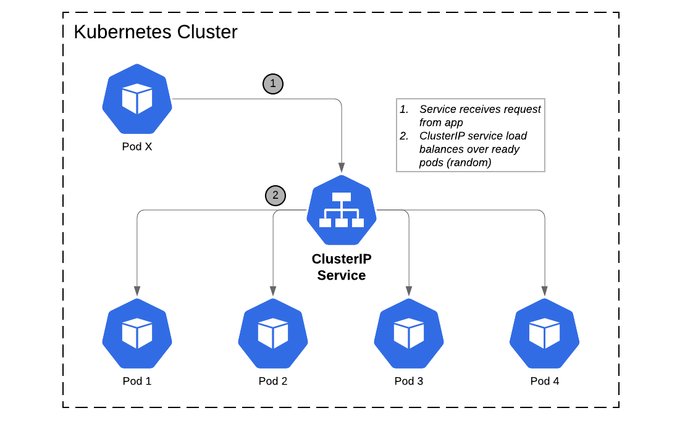

#### Cơ chế hoạt động của `ClusterIP`:

- Ví dụ: Tạo file service-clusterip.yaml với nội dung:

```
apiVersion: v1
kind: Service
metadata:
  name: my-service
spec:
  selector:
    app: MyApp
  ports:
    - protocol: TCP
      port: 80
      targetPort: 9376
```

- kubectl apply -f service-clusterip.yaml -> Tạo ra 1 service với name `my-service`, service này run trên port 80 và maps tới port 9376 của tất cả các pods có label là app=MyApp. K8s sẽ gán 1 IP cho service này (gọi là "cluster IP").

- Tất cả các node trong cụm k8s đều chạy thành phần `kube-proxy`. `kube-proxy` chịu trách nhiệm implementing virtual IP -> service (handle traffic tới các backend Pod). Tùy vào từng kiểu proxy mode(User space proxy, iptables proxy, IPVS proxy) mà `kube-proxy` sẽ có các cơ chế handle traffic khác nhau. Mình sẽ giới thiệu 2 kiểu proxy mode: Iptables và IPVS

#### Iptables proxy mode

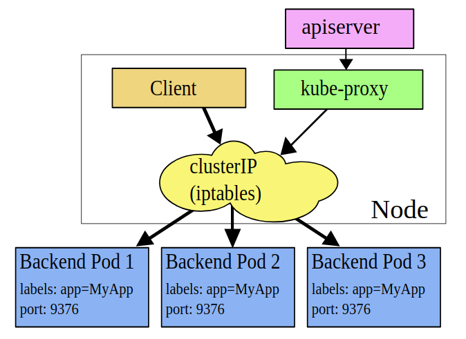

- Trong mode này, `kube-proxy` watches control plane khi add/remove service. Với mỗi service khi được tạo, nó sẽ thực hiện tạo ra các rules iptables để thực hiện điều phối traffic tới các pods backend tương ứng (tạo ra các rules NAT trong Iptables, ta có thể kiểm tra bằng lệnh `iptables -L -n -t NAT`)

- Sử dụng iptables để handle traffic sẽ `lower system overhead`, bởi vì traffic được xử lý bởi Linux netfilter mà không cần phải switch giữa `userspace` và `kernel space`. Đây là 1 ưu điểm của `Iptables proxy mode`.

- Default, `kube-proxy` ở mode này điều phối các traffic bằng cách chọn random vào các pods backend, nếu Pod backend đầu tiên bị lỗi không phản hồi thì connection này fails. Ta có thể sử dụng `readliness` Pod để verify các backend pods có hoạt động OK ko, bằng cách này `kube-proxy` sẽ biết được pods backend nào đang hoạt động tốt và tránh được việc gửi traffic tới pod backend đang bị lỗi.

#### IPVS proxy mode

- Trong mode này, khi truy cập vào `service`, `kube-proxy` sẽ tạo ra các rules IPVS để điều phối traffic tới các backend pods tương ứng.

- IPVS proxy mode based trên netfilter hook function tương tự như `iptables mode` nhưng sử dụng hash table làm cấu trúc dữ liệu và nó hoạt động ở kernel namespace -> `kube-proxy` ở IPVS mode sẽ chuyển hướng traffic với latency thấp hơn sơ với `iptables mode`, hiệu suất, throughput network traffic cao hơn.

- IPVS cung cấp các kiểu tùy chọn balancing traffic tới backend pods:

+ rr: round-robin
+ lc: least connection
+ dh: destination hashing
+ sh: source hashing
+ sed: shortest expected delay
+ nq: never queue

- Lưu ý: Để run `kube-proxy` ở IPVS mode, ta cần đảm bảo modules IPVS kernel ở node được enable. Nếu IPVS kernel modules không tìm thấy, thì `kube-proxy` sẽ tự động run ở `iptables proxy mode`.

#### Kết nối tới `service` trong k8s

- Kết nối trong namespace:

+ Namespace: Trong k8s, namespace dùng để tạo ra các môi trường development, staging, và production trong cluster (sử dụng namespace kết hợp với `network policy`. RBAC để cô lập các môi trường dev, staging, product). Một trường hợp sử dụng khác mà namespaces có thể hỗ trợ là phân chia workloads theo mong muốn của người dùng.

+ Mỗi service có 1 tên riêng và được map tới 1 IP (gọi là Cluster IP ). Giả sử, ta có 1 service tên là `php-service` ở trong ns `my-ns`. DNS service trong k8s sẽ tạo ra 1 bản ghi tên là `php-service.my-ns` phân giải tới 1 IP( Cluster IP này đại diện cho 1 hoặc nhiều backend pods). Tất cả các pods trong namespace `my-ns` sẽ hiểu tên service `php-service` như `php-service.my-ns` -> tất cả các pods trong ns `my-ns` có thể call tới service với name `php-service`.
 
- Kết nối ngoài namespace: Các pods không thuộc namespace `my-ns` muốn call tới service `php-service` phải khai báo đầy đủ <tên-service>.<tên-namespace> cụ thể ở đây là `php-service.my-ns`.


#### Nodeport

- Với kiểu `Cluster IP` thì các Pods hay Services trong cụm k8s có thể tương tác với nhau nhưng bên ngoài sẽ không thể tương tác được. Kiểu `NodePort` giúp Service có thể tương tác được từ bên ngoài thông qua port của các node.

- Khởi tạo file svc-nodeport.yaml:

```
apiVersion: v1
kind: Service
metadata:
  name: svc-nodeport
spec:
  selector:
    app: nginx  # select tới các pods có label: app=nginx
  type: NodePort
  ports:
  - port: 80  # port cluster Ip
    targetPort: 8080 # port pods
    nodePort: 30123 # port của node
```
  
- Kiểm tra thông tin service:

```
$ kubectl get svc svc-nodeport
NAME           CLUSTER-IP      EXTERNAL-IP   PORT(S) AGE
svc-nodeport 10.111.254.221   <nodes>      80:30123/TCP 2m
```

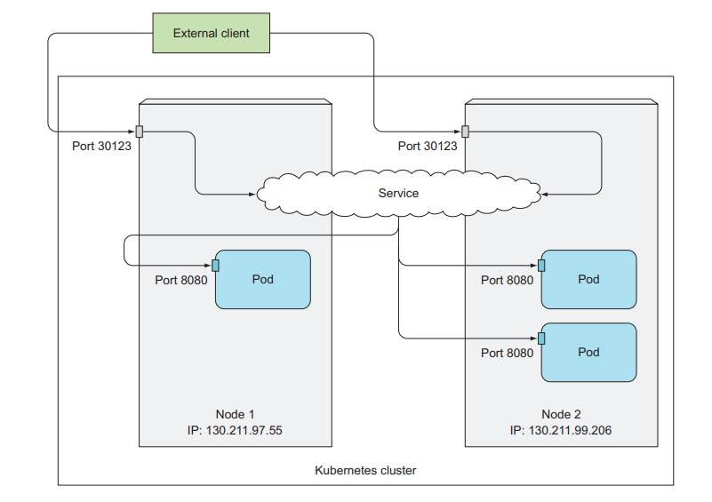

- Khi tương tác với service, client sẽ truy cập qua <Địa chỉ Ip của Node>:<Port>. Ở trong ví dụ này: 130.211.97.55:30123, 130.211.99.206:30123

- Default, range port với `node port`: 30000-32767

- Nhược điểm: Khi client call tới service kiểu `Nodeport`, client sẽ tương tác tới 1 trong các node trong cụm k8s. Nếu Node/VM này gặp sự cố, bạn cần phải xử lý vấn đề đó (single point of failure). Để giải quyết vấn đề này, ta có thể sử dụng 1 Loadbalancer ở bên ngoài hoặc sử dụng kiểu service `Loadbalancer`.

#### Loadbalancer

- Với hệ thống k8s của Cloud providers(AWS, GCP...) khi tạo một Service kiểu Loadblancer sẽ cung cấp thêm địa chỉ IP public để client bên ngoài có thể gửi request đến.

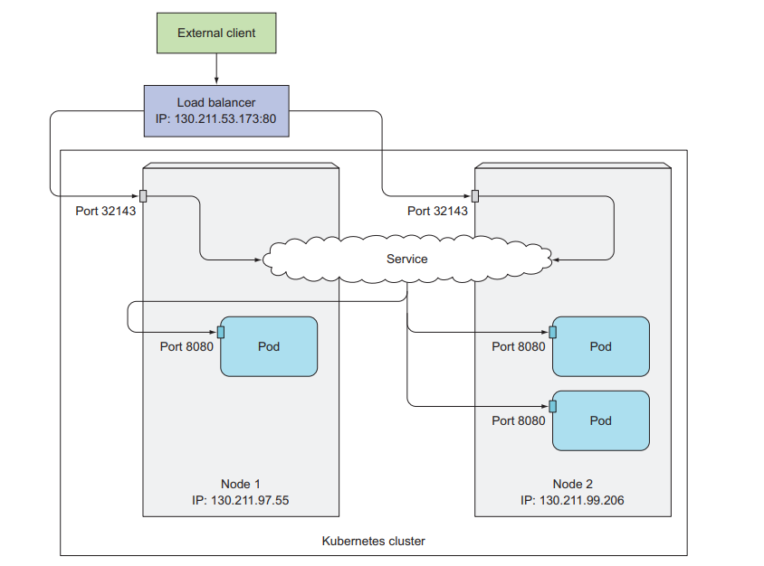

- Khởi tạo file svc-loadbalancer.yaml:

```
apiVersion: v1
kind: Service
metadata:
 name: svc-loadbalancer
spec:
 type: LoadBalancer
 ports:
 - port: 80
 targetPort: 8080
 selector:
 app: nginx
```

- Tạo Service:

```
kubectl apply -f svc-loadbalancer.yaml
```

- Kết quả:

```
$ kubectl get svc svc-loadbalancer
NAME               CLUSTER-IP      EXTERNAL-IP     PORT(S) AGE
svc-loadbalancer 10.111.241.153  130.211.53.173  80:32143/TCP 1m
```
### 5. Ingress

- Ingress là 1 resource K8s (NOT a type of service) cho phép định tuyến HTTP/HTTPs từ bên ngoài tới các service chạy trên k8s. Việc định tuyến các traffic này được quản lý bởi các rules trong Ingress resource. Và cần có 1 `Ingress controller` (như nginx, haproxy, Kong...) để thực hiện các rules này.


- Ví dụ:
  + Map foo.mydomain.com -> service foo
  + Map mydomain.com/bar -> service bar

- File ingress.yaml:

```
apiVersion: extensions/v1beta1
kind: Ingress
metadata:
  name: my-ingress
spec:
  backend:
    serviceName: other
    servicePort: 8080
  rules:
  - host: foo.mydomain.com
    http:
      paths:
      - backend:
          serviceName: foo
          servicePort: 8080
  - host: mydomain.com
    http:
      paths:
      - path: /bar/*
        backend:
          serviceName: bar
          servicePort: 8080
```

### 6. Tài liệu tham khảo:

- https://kubernetes.io/docs/concepts/services-networking

- Diving deep into kubernetes networking

- Kubernetes in Action.

