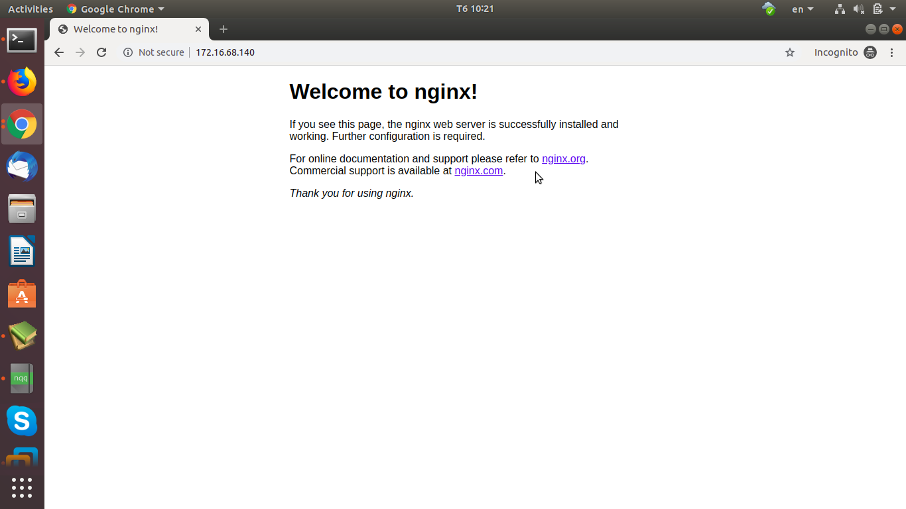

### Hướng dẫn sử dụng metallb làm loadbalancer (Lab)

### 1. Mô hình

- Cụm k8s:
	
	* master:  172.16.68.209 - ubuntu 18.04
	
	* worker1: 172.16.68.220 - ubuntu 18.04
	
	* worker2: 172.16.68.217 - ubuntu 18.04

### 2. Cài đặt và cấu hình

- Thực hiện trên node master:

- B1: Cài đặt metallb

```
mkdir -p ~/metallb
cd metallb
wget https://raw.githubusercontent.com/google/metallb/v0.8.1/manifests/metallb.yaml 
```

- B2: Apply file metallb.yaml

```
kubectl apply -f metallb.yaml
```

- B3: Check MetalLB running chưa:

```
kubectl get pods -n metallb-system
NAME                         READY   STATUS    RESTARTS   AGE
controller-7f8b4dbc4-2mkt6   1/1     Running   0          24h
speaker-262ht                1/1     Running   0          41h
speaker-7zg4w                1/1     Running   1          41h
speaker-mzbjj                1/1     Running   0          41h
```

- B3: Config MetalLB. Tạo file config.yaml 

```
apiVersion: v1
kind: ConfigMap
metadata:
  namespace: metallb-system
  name: config
data:
  config: |
    address-pools:
    - name: default
      protocol: layer2
      addresses:
      - 172.16.68.140-172.16.68.145
```

- B4: Apply file confile metallb

```
kubectl apply -f config.yaml
```

- B5: Tạo file nginx-deployment.yaml

```
apiVersion: apps/v1
kind: Deployment
metadata:
  name: test
  labels:
    app: test
spec:
  selector:
    matchLabels:
      app: test
  replicas: 3
  template:
    metadata:
      labels:
        app: test
    spec:
      containers:
      - name: nginx
        image: nginx
        ports:
        - containerPort: 80
```

- B6: Apply file nginx-deployment.yaml

```
kubectl apply -f nginx-deployment.yaml
```

- B7: Tạo file nginx-service.yaml

```
apiVersion: v1
kind: Service
metadata:
  name: test
  #  namespace: ingress-nginx
spec:
  selector:
    app: test
  ports:
  - name: http
    protocol: TCP
    port: 80
    targetPort: 80
  type: LoadBalancer
```

- B8: Apply file nginx-service.yaml

```
kubectl apply -f nginx-service.yaml
```

- B9: Check service nginx vừa tạo:

```
kubectl get svc 
NAME             TYPE           CLUSTER-IP       EXTERNAL-IP     PORT(S)        AGE
kubernetes       ClusterIP      10.96.0.1        <none>          443/TCP        3d12h
nginx            ClusterIP      10.103.200.159   <none>          80/TCP         19h
test             LoadBalancer   10.96.47.158     172.16.68.140   80:30332/TCP   41h
```

- B10: Check kết quả


