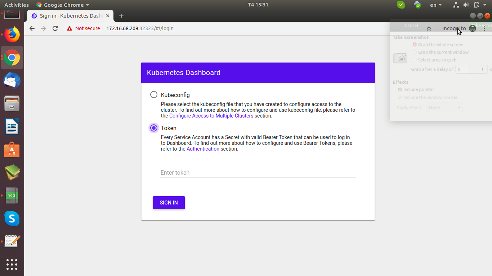
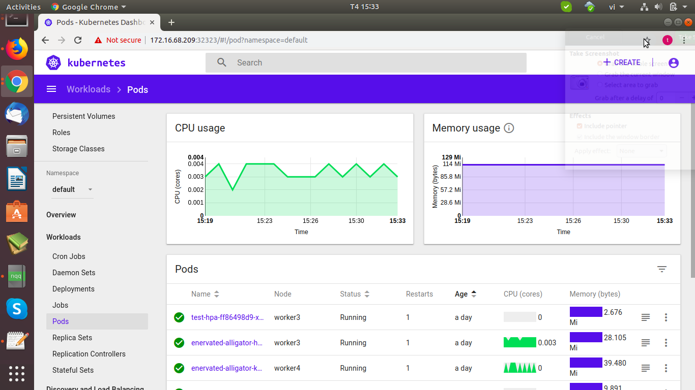

### Cài đặt và cấu hình Dashboard K8s

### Mô hình:

- Cụm k8s:
	
	* Master: 172.16.68.209
	
	* Worker1: 172.16.68.210
	
	* Worker2: 172.16.68.211

### Các bước thực hiện:

- Tạo thư mục cấu hình Dashboard

```
mkdir dashboard_k8s
cd dashboard_k8s
```

- Tạo file influxdb.yaml để cấu hình influxdb

```
apiVersion: extensions/v1beta1
kind: Deployment
metadata:
  name: monitoring-influxdb
  namespace: kube-system
spec:
  replicas: 1
  template:
    metadata:
      labels:
        task: monitoring
        k8s-app: influxdb
    spec:
      containers:
      - name: influxdb
        image: k8s.gcr.io/heapster-influxdb-amd64:v1.5.2
        env:
        - name: INFLUXDB_BIND_ADDRESS
          value: 127.0.0.1:8088
        volumeMounts:
        - mountPath: /data
          name: influxdb-storage
      volumes:
      - name: influxdb-storage
        emptyDir: {}
---
apiVersion: v1
kind: Service
metadata:
  labels:
    task: monitoring
    # For use as a Cluster add-on (https://github.com/kubernetes/kubernetes/tree/master/cluster/addons)
    # If you are NOT using this as an addon, you should comment out this line.
    kubernetes.io/cluster-service: 'true'
    kubernetes.io/name: monitoring-influxdb
  name: monitoring-influxdb
  namespace: kube-system
spec:
  ports:
  - port: 8086
    targetPort: 8086
  selector:
    k8s-app: influxdb
```

- Apply file influxdb.yaml

```
kubectl apply -f influxdb.yaml
```

- Tạo file heapster.yaml

```
apiVersion: v1
kind: ServiceAccount
metadata:
  name: heapster
  namespace: kube-system
---
apiVersion: rbac.authorization.k8s.io/v1beta1
kind: ClusterRoleBinding
metadata:
  name: heapster-rolebinding
roleRef:
  apiGroup: rbac.authorization.k8s.io
  kind: ClusterRole
  name: cluster-admin
subjects:
- kind: ServiceAccount
  name: heapster
  namespace: kube-system
---
apiVersion: extensions/v1beta1
kind: Deployment
metadata:
  name: heapster
  namespace: kube-system
spec:
  replicas: 1
  template:
    metadata:
      labels:
        task: monitoring
        k8s-app: heapster
    spec:
      serviceAccountName: heapster
      containers:
      - name: heapster
        image: k8s.gcr.io/heapster-amd64:v1.5.4
        imagePullPolicy: IfNotPresent
        command:
        - /heapster
        - --source=kubernetes:https://kubernetes.default?useServiceAccount=true&kubeletHttps=true&kubeletPort=10250&insecure=true
        - --sink=influxdb:http://monitoring-influxdb.kube-system.svc:8086
---
apiVersion: v1
kind: Service
metadata:
  labels:
    task: monitoring
    # For use as a Cluster add-on (https://github.com/kubernetes/kubernetes/tree/master/cluster/addons)
    # If you are NOT using this as an addon, you should comment out this line.
    kubernetes.io/cluster-service: 'true'
    kubernetes.io/name: Heapster
  name: heapster
  namespace: kube-system
spec:
  ports:
  - port: 80
    targetPort: 8082
  selector:
    k8s-app: heapster
```

- Apply file heapster.yaml

```
kubectl apply -f heapster.yaml
```

- Tạo file dashboard.yaml

```
# ------------------- Dashboard Secret ------------------- #

apiVersion: v1
kind: Secret
metadata:
  labels:
    k8s-app: kubernetes-dashboard
  name: kubernetes-dashboard-certs
  namespace: kube-system
type: Opaque

---
# ------------------- Dashboard Service Account ------------------- #

apiVersion: v1
kind: ServiceAccount
metadata:
  labels:
    k8s-app: kubernetes-dashboard
  name: kubernetes-dashboard
  namespace: kube-system

---
# ------------------- Dashboard Role & Role Binding ------------------- #

kind: Role
apiVersion: rbac.authorization.k8s.io/v1
metadata:
  name: kubernetes-dashboard-minimal
  namespace: kube-system
rules:
  # Allow Dashboard to create 'kubernetes-dashboard-key-holder' secret.
- apiGroups: [""]
  resources: ["secrets"]
  verbs: ["create"]
  # Allow Dashboard to create 'kubernetes-dashboard-settings' config map.
- apiGroups: [""]
  resources: ["configmaps"]
  verbs: ["create"]
  # Allow Dashboard to get, update and delete Dashboard exclusive secrets.
- apiGroups: [""]
  resources: ["secrets"]
  resourceNames: ["kubernetes-dashboard-key-holder", "kubernetes-dashboard-certs"]
  verbs: ["get", "update", "delete"]
  # Allow Dashboard to get and update 'kubernetes-dashboard-settings' config map.
- apiGroups: [""]
  resources: ["configmaps"]
  resourceNames: ["kubernetes-dashboard-settings"]
  verbs: ["get", "update"]
  # Allow Dashboard to get metrics from heapster.
- apiGroups: [""]
  resources: ["services"]
  resourceNames: ["heapster"]
  verbs: ["proxy"]
- apiGroups: [""]
  resources: ["services/proxy"]
  resourceNames: ["heapster", "http:heapster:", "https:heapster:"]
  verbs: ["get"]

---
apiVersion: rbac.authorization.k8s.io/v1
kind: RoleBinding
metadata:
  name: kubernetes-dashboard-minimal
  namespace: kube-system
roleRef:
  apiGroup: rbac.authorization.k8s.io
  kind: Role
  name: kubernetes-dashboard-minimal
subjects:
- kind: ServiceAccount
  name: kubernetes-dashboard
  namespace: kube-system

---
# ------------------- Dashboard Deployment ------------------- #

kind: Deployment
apiVersion: apps/v1beta2
metadata:
  labels:
    k8s-app: kubernetes-dashboard
  name: kubernetes-dashboard
  namespace: kube-system
spec:
  replicas: 1
  revisionHistoryLimit: 10
  selector:
    matchLabels:
      k8s-app: kubernetes-dashboard
  template:
    metadata:
      labels:
        k8s-app: kubernetes-dashboard
    spec:
      containers:
      - name: kubernetes-dashboard
        image: k8s.gcr.io/kubernetes-dashboard-amd64:v1.10.1
        ports:
        - containerPort: 8443
          protocol: TCP
        args:
          - --auto-generate-certificates
          # Uncomment the following line to manually specify Kubernetes API server Host
          # If not specified, Dashboard will attempt to auto discover the API server and connect
          # to it. Uncomment only if the default does not work.
          # - --apiserver-host=http://my-address:port
        volumeMounts:
        - name: kubernetes-dashboard-certs
          mountPath: /certs
          # Create on-disk volume to store exec logs
        - mountPath: /tmp
          name: tmp-volume
        livenessProbe:
          httpGet:
            scheme: HTTPS
            path: /
            port: 8443
          initialDelaySeconds: 30
          timeoutSeconds: 30
      volumes:
      - name: kubernetes-dashboard-certs
        secret:
          secretName: kubernetes-dashboard-certs
      - name: tmp-volume
        emptyDir: {}
      serviceAccountName: kubernetes-dashboard
      # Comment the following tolerations if Dashboard must not be deployed on master
      tolerations:
      - key: node-role.kubernetes.io/master
        effect: NoSchedule

---
# ------------------- Dashboard Service ------------------- #

kind: Service
apiVersion: v1
metadata:
  labels:
    k8s-app: kubernetes-dashboard
  name: kubernetes-dashboard
  namespace: kube-system
spec:
  type: NodePort
  ports:
    - port: 443
      targetPort: 8443
      nodePort: 32323
  selector:
    k8s-app: kubernetes-dashboard
```

- Apply file dashboard.yaml

```
kubectl apply -f dashboard.yaml
```

- Tạo file service-account.yaml để đăng nhập giao diện dashboard.

```
apiVersion: v1
kind: ServiceAccount
metadata:
  name: dashboard-admin
  namespace: kube-system
---
apiVersion: rbac.authorization.k8s.io/v1beta1
kind: ClusterRoleBinding
metadata:
  name: cluster-admin-rolebinding
roleRef:
  apiGroup: rbac.authorization.k8s.io
  kind: ClusterRole
  name: cluster-admin
subjects:
- kind: ServiceAccount
  name: dashboard-admin
  namespace: kube-system
```

- Apply file service-account.yaml

```
kubectl apply -f service-account.yaml
```

- Check secret-key vừa tạo

```
kubectl get secret -n kube-system
dashboard-admin-token-xdrl7                      kubernetes.io/service-account-token   3      20m
```

- Lấy token để đăng nhập vào dashboard

```
kubect describe secret dashboard-admin-token-xdrl7 -n kube-system
Data
====
ca.crt:     1025 bytes
namespace:  11 bytes
token:      ahihi_eyJhbGciOiJSUzI1NiIsImtpZCI6IiJ9.eyJpc3MiOiJrdWJlcm5ldGVzL3NlcnZpY2VhY2NvdW50Iiwia3ViZXJuZXRlcy5pby9zZXJ2aWNlYWNjb3VudC9uYW1lc3BhY2UiOiJrdWJlLXN5c3RlbSIsImt1YmVybmV0ZXMuaW8vc2VydmljZWFjY291bnQvc2VjcmV0Lm5hbWUiOiJkYXNoYm9hcmQtYWRtaW4tdG9rZW4teGRybDciLCJrdWJlcm5ldGVzLmlvL3NlcnZpY2VhY2NvdW50L3NlcnZpY2UtYWNjb3VudC5uYW1lIjoiZGFzaGJvYXJkLWFkbWluIiwia3ViZXJuZXRlcy5pby9zZXJ2aWNlYWNjb3VudC9zZXJ2aWNlLWFjY291bnQudWlkIjoiNTFhYjQ0YTgtYzNlNS0xMWU5LTg1NDQtNTI1NDAwN2NmNGFjIiwic3ViIjoic3lzdGVtOnNlcnZpY2VhY2NvdW50Omt1YmUtc3lzdGVtOmRhc2hib2FyZC1hZG1pbiJ9.ftSUVXEf9vqfMO8Y0EgL13onyCi3aHFaQH7Vxvq1AC88nJM_He7OCh1NR1vdnT1yqN26J2ka2wOlf63c2PqiY5Kt8rA3tNbxCIwfraLvwYAlxRRpou2Cbt1cp9AUXnWiTaYMYILaKwPY2OMFXoIGb69MIwEpGBH5KbWihcaDthkldizU7DjbtJXQZdH-IFqhlEoIpbJAUlAJVYIma73_Wejl2WppQvBXpkOlYFwUcglqcMGxwC_7JmPupqsdHKUnJRkmJPsPX1SaL6kFttiSf7Yp9Kfm7SOQ7BGLJStDIkwQnMEGst
```

- Đăng nhập vào dashboard với token vừa tạo ở trên.





### Tài liệu tham khảo:

- https://docs.aws.amazon.com/eks/latest/userguide/dashboard-tutorial.html

- https://github.com/kubernetes/dashboard/wiki/Installation

- https://github.com/kubernetes/dashboard/blob/master/README.md

- https://brookbach.com/2018/10/29/Heapster-on-Kubernetes-1.11.3.html
